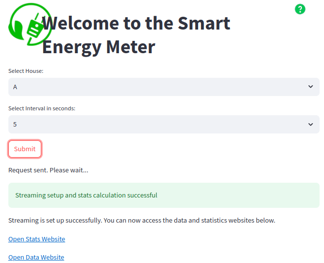
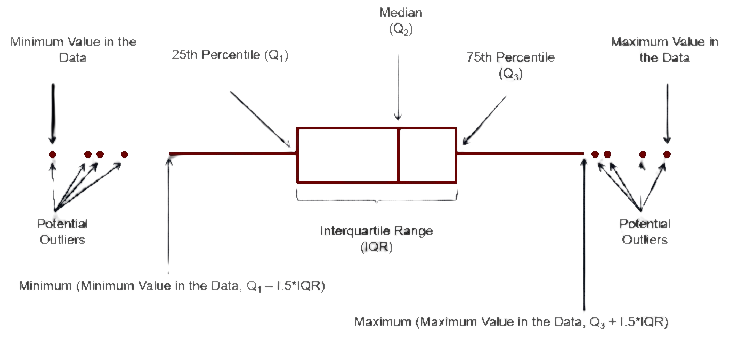

Generation and Simulation of Time-Series Data from Smart-Meters (AC, Geyser, Overall) in 3 Different Households
----------------------------------------------------
- [GitHub](https://github.com/pranoyghosh35/smart_home_backend.git)
- Note: The free web service on Render may respond slowly (~50 seconds) due to inactivity.

## Overview

This project involves generating realistic fake data for energy consumption in three different households and using a Flask application to stream this data to users. The households include:

- Household A: A day worker's home. AC is used during evening/night hours, Geyser is used in the morning and evening, 
  and there is always some baseline overall energy consumption.

- Household B: An office. AC is used during office hours (9 AM - 5 PM), Geyser is rarely used, and there is 
  higher overall energy consumption during office hours.

- Household C: A shift worker's home.AC and Geyser usage varies depending on the shift (night/day), and there is 
  always some baseline overall energy consumption which varies with the shift.

The types of energy consumption tracked are AC, Geyser, and Overall consumption.

## Directory Tree


Below we describe 2 most important of these:

### Generating Synthetic Data in kW-min

- J is energy, J/sec is Power. 1 kW-min = 60 kJ energy.
- But this unit gives an intutive sense of power*time=energy consumed by appliance.  

The `gen_fake_data.py` script is responsible for generating the synthetic time-series data. It creates data with a resolution of 1 second, both with and without noise ("realistic_fake_energy_data_with_errors.csv" , "realistic_fake_energy_data_without_errors.csv" respectively ), to simulate real-world scenarios. The script generates separate datasets for each household, considering the unique energy consumption patterns for a home, an office, and a shift worker's home.


### Running Flask Application will be our server

The 'app.py' handles user requests and streams the generated data using Server-Sent Events (SSE). The application allows users to specify a household and an interval in seconds (say 5, 15, 30, or 60 seconds?) to average the energy consumption data.

```python
"""
Flask application for streaming energy consumption data.

Routes:
    /stream_setup (POST)
        Sets up the streaming for a specified household and interval.

    /stream_qstats (GET)
        Provides quick statistics from the data for outlier detection.

    /stream_data (GET)
        Streams the average energy consumption data at the specified interval.

Functions:
    stream_setup() -> Response
        Handles the setup of data streaming based on user input.

    stream_qstats() -> Response
        Returns quick statistics for outlier detection.

    stream_data() -> Response
        Streams the data at the specified interval.
"""
```
## Step-by-Step Usage

### Step 1: Setup Data Streaming

URL: https://smart-home-backend-95to.onrender.com/stream_setup

--------------------------------------------------------
- Note: You can hit the APIs and check responses through Postman [online](https://go.postman.co/home) 

OR

- #### use our [interface](https://smarter-energy-ui.onrender.com)
.


------------------------------------------------------

- Example API request (POST Method only):
    ```json
	{
	    "household": "A",
	    "interval": 5
	}
    ```
- Optional Parameter: start_index (calculated as curr_hr * 3600 + curr_min * 60 + curr_sec):

	```json
	{
	    "household": "A",
	    "interval": 5,
	    "start_index": 195950
	}
	```

- Example response:
    ```json
	{
	    "status": "Streaming setup and stats calculation successful"
	}
    ```

- Appropriate error message is shown if household not in list or interval is invalid value.


### Step 2: Get Quick Statistics

URL: https://smart-home-backend-95to.onrender.com/stream_qstats

This endpoint provides quick statistics from the noise-free data ("realistic_fake_energy_data_without_errors.csv") for outlier detection and understanding expected baseline energy consumption patterns.


- We report back 25p,50p (median), 75p, where the critical region on right side starts at a significance level of 1%, best fit distribution for each appliance (AC, Geyser, Overall) from the synthetic data without noise after averaging at same interval as streaming data, as we believe statistical property won't change with time.


- Now we can write simple logic to identify outlier events and also decide their priority.

- Some ideas:

  

  1. 25p-50p : Green region. User doing well.
  2. 75p- : Yellow region. User needs to take some action

  

  3. energy value <0 or energy value >= right side : Red region
  
  4. error : Critical Red.


### Step-3: Stream Data

URL: https://smart-home-backend-95to.onrender.com/stream_data

- Example response:


     
## Instructions for local installation and use

```
git clone https://github.com/pranoyghosh35/smart_home_backend.git
```
- Recommended Step-0: Create a virtual environment 
```
python3 -m venv venv
```
Activate it on Windows: venv\Scripts\activate Activate it on macOS and Linux: source venv/bin/activate

- Step-1. 
```
pip install -r requirements.txt
```
- Step-2. 
```
python3 app.py
```
Or build docker image and start it.

- 
```
docker build -t my_app .
```
- 
```
docker run -p 5000:5000 -p 8501:8501 my_app
```
## Frontend

- Idea: 

An android "rectangular" text-only informative widget on home screen.

- receiving updates from this live server showing House Identification at top, time of server update received and next 3 lines average energy consumption: Overall, AC, Geyser. 


- The widget background changes colours :  ,  , 

according to priority of events and allowing to take actions.
