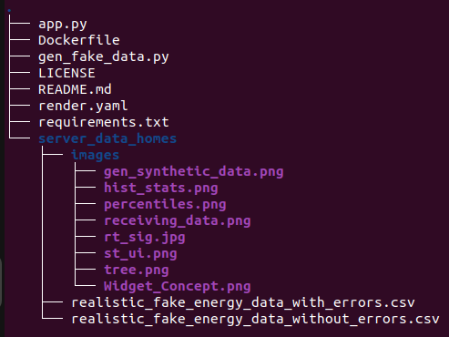
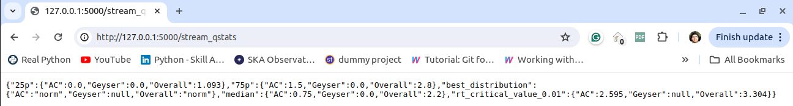

Generation and Simulation of Time-Series Data from Smart-Meters (AC, Geyser, Overall) in 3 Different Households
----------------------------------------------------
- Note: The free web service on Render may respond slowly (~50 seconds) due to inactivity.

## Overview

This project involves generating realistic fake data for energy consumption in three different households and using a Flask application to stream this data to users. The households include:

- Household A: A day worker's home.
- Household B: An office.
- Household C: A shift worker's home.

The types of energy consumption tracked are AC, Geyser, and Overall consumption.

## Directory Tree



Below we describe 2 most important of these:

### Generating Synthetic Data

The `gen_fake_data.py` script is responsible for generating the synthetic time-series data. It creates data with a resolution of 1 second, both with and without noise, to simulate real-world scenarios. The script generates separate datasets for each household, considering the unique energy consumption patterns for a home, an office, and a shift worker's home.


### Running Flask Application will be our server

The 'app.py' handles user requests and streams the generated data using Server-Sent Events (SSE). The application allows users to specify a household and an interval in seconds (say 5, 15, 30, or 60 seconds?) to average the energy consumption data.

```python
"""
Flask application for streaming energy consumption data.

Routes:
    /stream_setup (POST)
        Sets up the streaming for a specified household and interval.

    /stream_qstats (GET)
        Provides quick statistics from the data for outlier detection.

    /stream_data (GET)
        Streams the average energy consumption data at the specified interval.

Functions:
    stream_setup() -> Response
        Handles the setup of data streaming based on user input.

    stream_qstats() -> Response
        Returns quick statistics for outlier detection.

    stream_data() -> Response
        Streams the data at the specified interval.
"""
```
## Step-by-Step Usage

### Step 1: Setup Data Streaming

URL: https://smart-home-backend-95to.onrender.com/stream_setup

- Example API request (POST Method only):
    ```json
	{
	    "household": "A",
	    "interval": 5
	}
    ```
- Optional Parameter: start_index (calculated as curr_hr * 3600 + curr_min * 60 + curr_sec):

	```json
	{
	    "household": "A",
	    "interval": 5,
	    "start_index": 195950
	}
	```

- Example response:
    ```json
	{
	    "status": "Streaming setup successful"
	}
    ```

- Appropriate error message is shown if household not in list or interval is invalid value.

### Step 2: Get Quick Statistics

URL: https://smart-home-backend-95to.onrender.com/stream_qstats

This endpoint provides quick statistics from the noise-free data for outlier detection and understanding expected baseline energy consumption patterns.



### Step-3: Stream Data

URL: https://smart-home-backend-95to.onrender.com/stream_data

- Example response:


     
## Instructions for local installation and use

```
git clone https://github.com/pranoyghosh35/smart_home_backend.git
```
- Recommended Step-0: Create a virtual environment 
```
python3 -m venv venv
```
Activate it on Windows: venv\Scripts\activate Activate it on macOS and Linux: source venv/bin/activate

- Step-1. 
```
pip install -r requirements.txt
```
- Step-2. 
```
python3 app.py
```
Or build docker image and start it.

- 
```
docker build -t my_app .
```
- 
```
docker run -p 5000:5000 my_app
```
## Frontend

An android widget receiving updates from this live server showing time-series, changing colours according to events and allowing to take actions.

Webpage   :[link]

GitHub    :[link]
